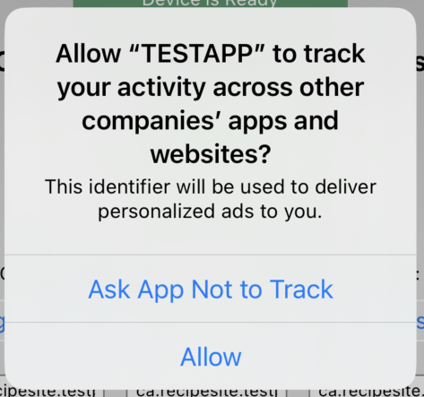

# Cordova-Plugin-Ads

jump to: [PLUGIN USAGE](#plugin-usage) | [Cordova](#create-app) | [ADD ADS](#add-ads) | [More](#more-plugin) | [cozycode.ca](#more-cozycode) | [Open Source License](#license) 
<hr/>

Updated __2023__ for [Cordova](https://cordova.apache.org/) with tracking consent:
<p align="center">

</p>

To include ads without any tracking, see: [cordova-plugin-ads-donottrack](https://github.com/cozycodegh/cordova-plugin-ads-donottrack)

***Cordova*** plugin to add ***ads*** (by Google AdMob) into an app. <br>
Use JavaScript to include ads in your app.

If you notice any issues, submit here: [github issues](https://github.com/cozycodegh/cordova-plugin-ads/issues)<br>

Have a good one!

# PLUGIN USAGE<a id="plugin-usage"></a><br>

Add these calls inside of your cordova JavaScript to show ads: <br>

<ins>banner ads</ins> <br>
[`adMob.banner(bannerId)`](docs/banner.md) <br>
[`adMob.removeBanner()`](docs/banner.md#remove-banner) <br>

<ins>full screen ads </ins><br>
[`adMob.interstitial(interstitialId)`](docs/interstitial.md)  <br>
[`adMob.showInterstitial()`](docs/interstitial.md#show-interstitial)  <br>

<ins>rewarded video ads </ins><br>
[`adMob.rewarded(rewardedId)`](docs/rewarded.md)  <br>
[`adMob.showRewarded()`](docs/rewarded.md#show-rewarded)  <br>

<ins>rewarded full screen video ads</ins> (new, and better supported than rewarded ads) <br>
[`adMob.rewardedInterstitial(rewardedInterstitialId)`](docs/rewardedInterstitial.md)  <br>
[`adMob.showRewardedInterstitial()`](docs/rewardedInterstitial.md#show-rewarded-interstitial)  <br>

The plugin creates an `adMob` object that can request to load new ads. <br>
Note: to fund the development of the plugin, the plugin requests 2% of ads for the plugin developer. <br>

# CREATE AN APP WITH CORDOVA<a id="create-app"></a><br>

How to create a Cordova app: <br>
```properties
npm install -g cordova
cordova create directory_name com.your_name_or_company.your_app_name
```
<p align="center">

</p>

Cordova is an open source project maintained by Apache that lets you make apps written in HTML, css, and JavaScript. You can create cross-platform apps to publish on the Google Play Store for Android, and the Appstore for iOS, MacOS, and Apple devices.

# ADD ADS<a id="add-ads"></a><br>

1. Add the plugin<br>
```properties
cordova plugin add cordova-plugin-ads
```
    
2. Test that ads are working using test banners, use the id "test" to load test banners from the plugin
```
var test_ad_id = "test";

async function runAllOfTheAds(){
    await adMob.banner(test_ad_id).then(function(){
        alert("loaded banner ads");
    }).catch(function(err){
        alert("unable to load ads: "+JSON.stringify(err));
    });
    
    await adMob.interstitial(test_ad_id).then(function(){
        alert("loaded interstitial ads");;
        return adMob.showInterstitial();
    }).then(function(){
        alert("showed interstitial ads");
    }).catch(function(err){
        alert("unable to load ads: "+JSON.stringify(err));
    });
    
    await adMob.rewarded(test_ad_id).then(function(){
        console.log("loaded rewarded ads");
        return adMob.showRewarded();
    }).then(function(reward){
        alert("showed rewarded ads"+JSON.stringify(reward));
    }).catch(function(err){
        alert("unable to load rewarded ads: "+JSON.stringify(err));
    });
    
    await adMob.rewardedInterstitial(test_ad_id).then(function(){
        alert("loaded rewarded ads");
        return adMob.showRewardedInterstitial();
    }).then(function(reward){
        alert("showed rewarded ads"+JSON.stringify(reward));
    }).catch(function(err){
        alert("unable to load rewarded ads: "+JSON.stringify(err));
    });

}

function onDeviceReady() {
    runAllOfTheAds();
}
```

3. In your Google AdMob account, create ad units for your apps - note that the ads may return LOAD_AD_ERRORS errors (especially iOS) until the app has been approved, or while during testing
```
var admob_ids = {
    'android' : {
        'banner': "ca-app-pub-4029587076166791/6431168058",
        'interstitial': "ca-app-pub-4029587076166791/1370413062",
        'rewarded': "ca-app-pub-4029587076166791/9712771663",
        'rewardedInterstitial': "ca-app-pub-4029587076166791/3530506691"
    }, 'ios' : {
        'banner': "ca-app-pub-4029587076166791/6694891931",
        'interstitial': "ca-app-pub-4029587076166791/2436352227",
        'rewarded': "ca-app-pub-4029587076166791/5286441495",
        'rewardedInterstitial': "ca-app-pub-4029587076166791/2300620853"
    }
};

adMob.banner(admob_ids).then(function(){
    console.log("loaded banner ad");
}).catch(function(err){
    console.log("unable to load banner ad: "+JSON.stringify(err));
});
    
adMob.interstitial(admob_ids).then(function(){
    console.log("loaded interstitial ads");;
    return adMob.showInterstitial();
}).then(function(){
    console.log("showed interstitial ads");
}).catch(function(err){
    console.log("unable to load interstitial ads: "+JSON.stringify(err));
});

adMob.rewarded(admob_ids).then(function(){
    console.log("loaded rewarded ads");
    return adMob.showRewarded();
}).then(function(reward){
    console.log("showed rewarded ads"+JSON.stringify(reward));
}).catch(function(err){
    console.log("unable to load rewarded ads: "+JSON.stringify(err));
});

adMob.rewardedInterstitial(admob_ids).then(function(){
    console.log("loaded rewarded ads");
    return adMob.showRewardedInterstitial();
}).then(function(reward){
    console.log("showed rewarded ads"+JSON.stringify(reward));
}).catch(function(err){
    console.log("unable to load rewarded ads: "+JSON.stringify(err));
});
```

## More on the plugin: <a id="more-plugin"></a><br>
- wait for `deviceready` to fire before calling any functions <br>
- errors can be automatically retried after a timeout or ignored <br>
- `adMob` uses a promise-based API to load ads <br>
- since the API returns a promise, it is asynchronous... call it and continue with other actions, or await for it to finish from within an async function to wait for the call to finish <br>

# More from [cozycode.ca](https://cozycode.ca)<a id="more-cozycode"></a><br>

  * [make apps with JavaScript](https://cozycode.ca/post?pon=make-an-app-with-cordova)
  * [how to make an in-app purchases with Cordova](https://cozycode.ca/post?pon=cordova-plugin-inapppurchases)
  * [a testing app for in-app purchases](https://cozycode.ca/post?pon=cordova-plugin-inapppurchases-TEST-APP)
  * [a demo app for in-app purchases](https://cozycode.ca/post?pon=cordova-plugin-inapppurchases-DEMO-APP)

# Open Source License<a id="license"></a><br>

MIT Licensed (MIT)

Copyright © 2023 [cozycode.ca](https://cozycode.ca)

Permission is hereby granted, free of charge, to any person obtaining a copy of this software and associated documentation files (the “Software”), to deal in the Software without restriction, including without limitation the rights to use, copy, modify, merge, publish, distribute, sublicense, and/or sell copies of the Software, and to permit persons to whom the Software is furnished to do  so, subject to the following conditions:

The above copyright notice and this permission notice shall be included in all  copies or substantial portions of the Software.

THE SOFTWARE IS PROVIDED “AS IS”, WITHOUT WARRANTY OF ANY KIND, EXPRESS OR IMPLIED, INCLUDING BUT NOT LIMITED TO THE WARRANTIES OF MERCHANTABILITY, FITNESS FOR A PARTICULAR PURPOSE AND NONINFRINGEMENT. IN NO EVENT SHALL THE AUTHORS OR COPYRIGHT HOLDERS BE LIABLE FOR ANY CLAIM, DAMAGES OR OTHER LIABILITY, WHETHER IN AN ACTION OF CONTRACT, TORT OR OTHERWISE, ARISING FROM, OUT OF OR IN CONNECTION WITH THE SOFTWARE OR THE USE OR OTHER DEALINGS IN THE SOFTWARE.
