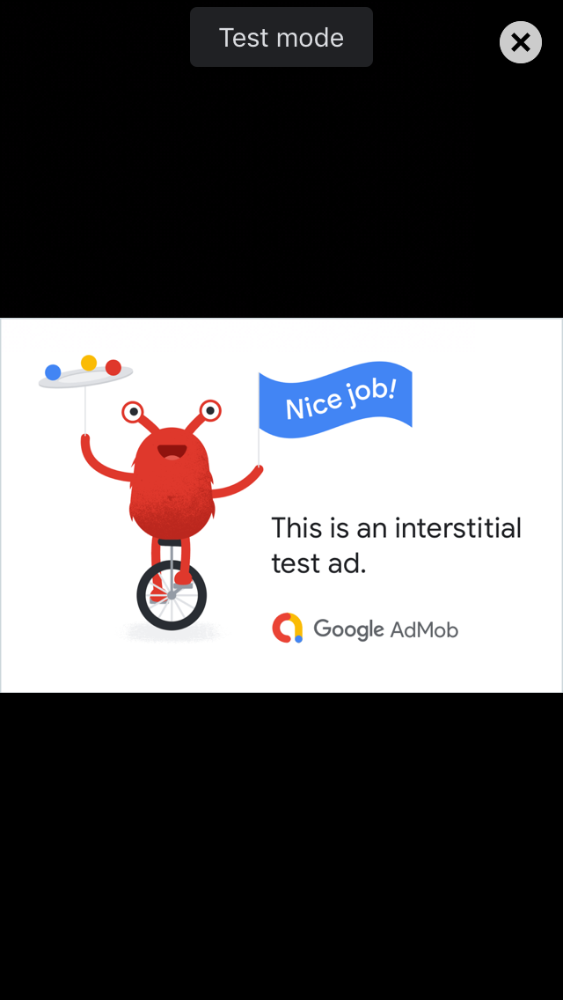

# interstitial ads

Full screen advertisements which are commonly displayed at break-points in an app.

jump to: [interstitial](#interstitial) | [showInterstitial](#show-interstitial) | [Example](#example)
<hr/>

<p align="center">

</p>

# adMob.interstitial(interstitial_id) <a id="interstitial"></a><br>

## Usage:
```js
adMob.interstitial(interstitial_id).then(function () {
    // interstitial is ready to be shown
}).catch (function(err){
    // view or handle error messages
});
```

## Description:
 - prepare a full screen interstitial ad (it may take 5 - 10 seconds to prepare)
 - can use after the start up of the device (`onDeviceReady`)
 - use at break-points in the app to show full screen ads which the user can dismiss

## Parameters:
` - Google AdMob id for a interstitial ad `
can be `"test"` for test ads, and ad string (`"ca-app-pub-4029587076166791/6431168058"`), or an ad_id object:
```
var admob_ids = {
    'android' : {
        'banner': "ca-app-pub-4029587076166791/6431168058",
        'interstitial': "ca-app-pub-4029587076166791/1370413062",
        'rewarded': "ca-app-pub-4029587076166791/9712771663",
        'rewardedInterstitial': "ca-app-pub-4029587076166791/3530506691"
    }, 'ios' : {
        'banner': "ca-app-pub-4029587076166791/6694891931",
        'interstitial': "ca-app-pub-4029587076166791/2436352227",
        'rewarded': "ca-app-pub-4029587076166791/5286441495",
        'rewardedInterstitial': "ca-app-pub-4029587076166791/2300620853"
    }
};
```

# adMob.showInterstitial() <a id="show-interstitial"></a><br>

## Usage:
```js
adMob.showInterstitial().then(function () {
    // do anything after interstitials were dismissed
    // eg. unpause a game that was paused to show the full screen ad
}).catch (function(err){
    // view or handle error messages
});
```

## Description:
 - show the interstitial ad
 - use after a call to interstitial to show the ad

## Parameters:
- none needed

## Errors:
```
- error["description"]      //short description about where the error is coming from 
- error["name"]             //name of the error (LOAD_AD_ERROR, SHOW_AD_ERROR, INVALID_ARGUMENTS, etc.) 
- error["message"]          //error message, more information about the error
- error["responseCode"]     //ad error response code from Google (if there is one)
- error["responseMessage"]  //ad error response message from Google (if there is one)
```
common error names:
LOAD_AD_ERROR may occur when an ad id is not reconized or not ready to show ads yet
SHOW_AD_ERROR will occur when an ad is called to show before it is ready

# Example <a id="example"></a><br>
```js
var ready_to_show_ad = false;
function prepareAd() {
    adMob.interstitial(interstitial_id).then(function({
        ready_to_show_ad = true;
    }).catch(function(err){});
}
function showAd(){
    if (!ready_to_show_ad) setTimeout(showAd, 100);
    // actions before showing ad, eg. pause game
    adMob.showInterstitial().then(function(){
        // actions after ad has been dismissed
        // eg. unpause game
    }).catch(function(err){});
}
```

<hr/>

<p align="center">

[go to main](../README.md#plugin-usage)

</p>
